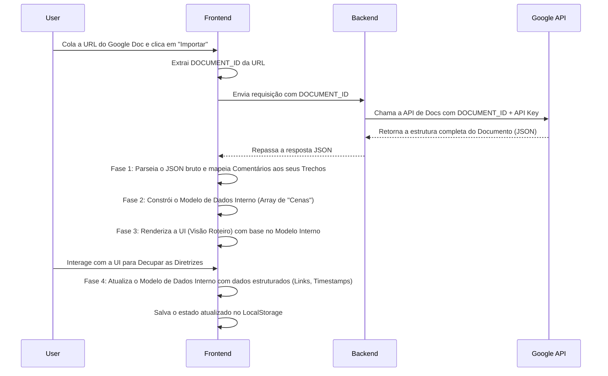

## 1. Visão Geral do Fluxo de Dados

O fluxo de dados descreve a jornada da informação, desde a sua fonte original (Google Docs) até a sua apresentação final na interface do usuário. Este processo pode ser dividido em quatro fases distintas.



## 2. Fase 1: Parsing do JSON da API do Google

A resposta da API do Google Docs é a fonte da verdade. Nossa primeira tarefa é extraí-la e mapear os dois elementos mais importantes: o **texto referenciado (`quotedFileContent`)** e o **conteúdo do comentário (`replies`)**.

- **Input:** Objeto JSON bruto da API.
- **Lógica:**
    1.  Acessar o objeto `document.comments`.
    2.  Iterar sobre cada chave de comentário (ex: `kix.abcdef12345`).
    3.  Para cada comentário, extrair:
        - `comment.quotedFileContent.value`: Este será o "Trecho Narrado".
        - O `content` da primeira `reply`: Este será o "Comentário Bruto".
    4.  Gerar um array de objetos simples, onde cada objeto representa um par Trecho/Comentário.

## 3. Fase 2: Construção do Modelo de Dados Interno

Este é o passo mais crucial. Nós transformamos os dados brutos em uma estrutura de estado limpa, flexível e pronta para ser usada pela UI. A estrutura principal será um array de objetos que chamaremos de **"Cenas"**.

- **Estrutura de um Objeto "Cena":**
    ```typescript
    interface Asset {
      id: string; // ID único para o asset (ex: UUID)
      tipo: 'video' | 'imagem' | 'audio' | 'link' | 'diretriz';
      valor: string; // O URL ou o texto da diretriz
      timestamp?: string; // Opcional
      nota?: string; // Opcional, para instruções específicas
    }

    interface Cena {
      id: string; // ID único para a cena (ex: cena-0, cena-1)
      trechoNarrado: string;
      comentarioBruto: string;
      status: 'Pendente' | 'Concluido' | 'Problema';
      notasEditor: string;
      assets: Asset[]; // Inicialmente vazio, será preenchido na fase de decupagem
    }
    ```

- **Lógica:** A aplicação itera sobre o resultado da Fase 1 e cria um array de objetos `Cena`. Inicialmente, a propriedade `assets` de cada cena estará vazia, e `comentarioBruto` conterá toda a diretriz.

## 4. Fase 4: Atualização do Modelo na Decupagem

Quando o usuário usa a ferramenta de Decupagem Assistida, ele não está modificando a UI diretamente. Ele está, na verdade, modificando o **Modelo de Dados Interno**. A UI então "reage" a essa mudança e se re-renderiza.

- **Exemplo de Fluxo de Decupagem:**
    1.  O usuário está decupando a `Cena[0]`.
    2.  Ele seleciona "https://youtube.com/..." no `comentarioBruto` e marca como `[Link de Vídeo]`.
    3.  A lógica da aplicação faz o seguinte:
        a. Cria um novo objeto `Asset`: `{ id: 'uuid-123', tipo: 'video', valor: 'https://youtube.com/...' }`.
        b. Adiciona este novo `Asset` ao array `Cena[0].assets`.
    4.  O framework de frontend (React/Vue) detecta a mudança no estado (`Cena[0]`) e atualiza a "Visão Tabela" automaticamente, exibindo o novo link na coluna correta para aquela cena.

## 5. Persistência de Dados (LocalStorage)

Após cada modificação no Modelo de Dados (seja na decupagem, mudança de status ou adição de notas), a aplicação irá serializar todo o array de "Cenas" para uma string JSON e salvá-lo no `localStorage` do navegador.

- **Chave:** `decupadorRoteiro_projetoAtual`
- **Valor:** `JSON.stringify(cenasArray)`

Quando a aplicação é carregada, ela primeiro verifica se há dados sob essa chave. Se houver, ela carrega e "hidrata" o estado da aplicação com o trabalho salvo, em vez de mostrar a tela de importação. Isso garante que o progresso do editor não seja perdido.